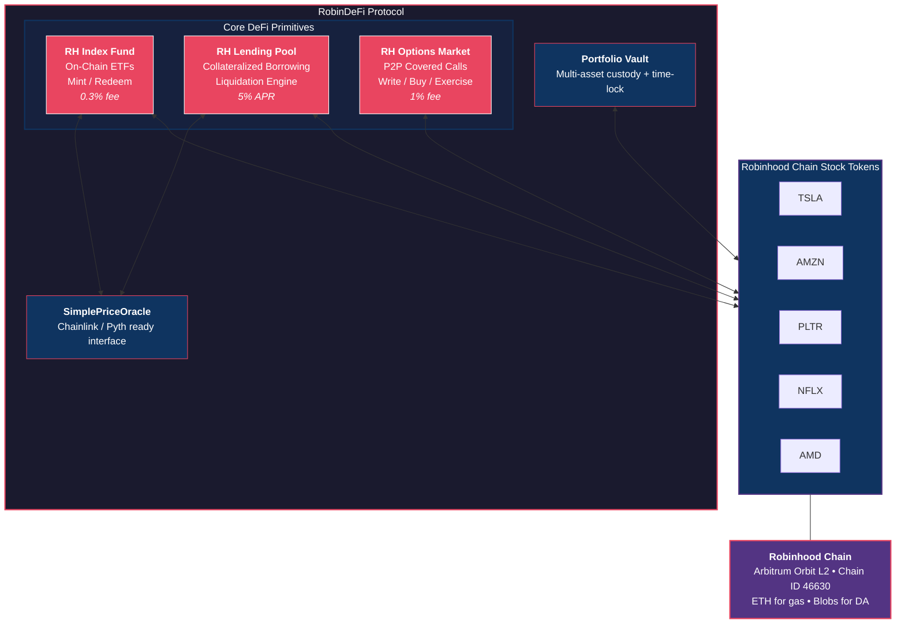
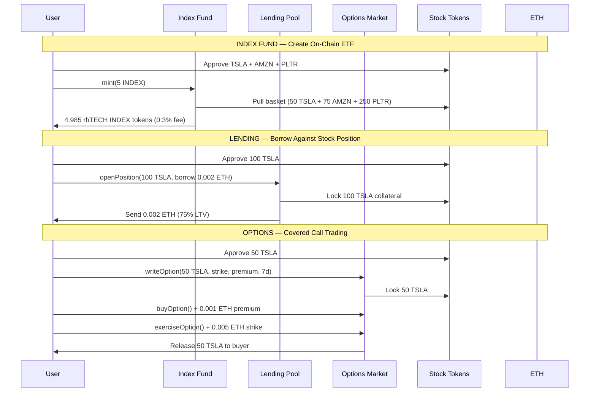

# RobinDeFi Protocol

**DeFi infrastructure purpose-built for Robinhood Chain Stock Tokens.**

> Wall Street charges billions for ETF management, margin lending, and options trading.
> We do it on-chain, trustlessly, 24/7, with no minimums — on Robinhood's own L2.

---

## The Problem

Robinhood Chain tokenizes equities (TSLA, AMZN, PLTR, NFLX, AMD) on an Arbitrum Orbit L2. But tokenized stocks without DeFi are just database entries with extra steps. To unlock real value, stock tokens need:

- **Composability** — combine tokens into index products (on-chain ETFs)
- **Capital efficiency** — borrow against holdings without selling
- **Derivatives** — hedge positions with options, not just buy/sell

None of this exists on Robinhood Chain today. RobinDeFi fills that gap.

---

## The Solution: 3 Core Protocols

### 1. RH Index Fund — On-Chain ETFs

Create custom index tokens backed 1:1 by baskets of stock tokens.

```
50 TSLA + 75 AMZN + 250 PLTR = 5 rhTECH INDEX tokens
```

| TradFi ETF | RobinDeFi Index |
|---|---|
| 0.03–1% annual fee | 0.3% one-time mint/redeem fee |
| Custodian required | Trustless, self-custodied |
| Pre-defined baskets only | Anyone can create custom indices |
| Business hours only | 24/7, instant settlement |
| Minimum investment | No minimum |

**Revenue model:** 0.3% fee on every mint and redeem.

### 2. RH Lending Pool — Margin Without the Margin Call

Deposit stock tokens as collateral. Borrow ETH instantly.

```
100 TSLA (worth 10 ETH) → borrow up to 7.5 ETH (75% LTV)
```

| TradFi Margin | RobinDeFi Lending |
|---|---|
| $25,000 minimum balance | No minimum |
| Application + approval process | Instant, permissionless |
| Opaque liquidation | Transparent, on-chain liquidation |
| Broker controls your assets | Self-custody, smart contract holds collateral |

**Revenue model:** 5% APR on borrows + liquidation penalties.

### 3. RH Stock Options — Covered Calls for Everyone

Write and trade covered call options peer-to-peer.

```
Writer locks 50 TSLA → sets strike 0.005 ETH, premium 0.001 ETH, 7-day expiry
Buyer pays premium → can exercise before expiry or let it expire
```

| TradFi Options | RobinDeFi Options |
|---|---|
| Per-contract broker fees | 1% protocol fee on premium only |
| Approval levels required | Permissionless |
| Counterparty risk | Fully collateralized, trustless |
| Limited hours | 24/7 trading |

**Revenue model:** 1% protocol fee on option premiums.

---

## Live on Testnet — Verified & Proven

All contracts are deployed, verified, and battle-tested on Robinhood Chain Testnet.

| Contract | Address | Status |
|---|---|---|
| **RH Index Fund** | [`0x9153F286...`](https://explorer.testnet.chain.robinhood.com/address/0x9153F286db0d9F0bB986a0D1a1C367Dc10950B27#code) | Verified |
| **RH Lending Pool** | [`0xE269c3F3...`](https://explorer.testnet.chain.robinhood.com/address/0xE269c3F395DAd330e33380b6b085b6850724E564#code) | Verified |
| **RH Options Market** | [`0x56302Ed3...`](https://explorer.testnet.chain.robinhood.com/address/0x56302Ed30a440a4f1150d6A5392f0856AdA12D62#code) | Verified |
| **Price Oracle** | [`0xfD7d75f5...`](https://explorer.testnet.chain.robinhood.com/address/0xfD7d75f5219F7D1590ccf6f392190A2FCc05E94F#code) | Verified |
| **Portfolio Vault** | [`0x45b6f99e...`](https://explorer.testnet.chain.robinhood.com/address/0x45b6f99e5A32e6a2457113D3DCCDAb07e157C13c#code) | Verified |

**Network:** Robinhood Chain Testnet (Arbitrum Orbit L2, Chain ID: 46630)

### On-Chain Proof (Testnet Transactions)

Every feature has been executed on-chain with real transactions:

- Minted 5 rhTECH INDEX tokens from basket of TSLA + AMZN + PLTR
- Redeemed 2 INDEX back to underlying tokens
- Opened lending position: 100 TSLA collateral, borrowed 0.002 ETH
- Health factor: 42,500,000 (extremely safe at 75% LTV)
- Repaid debt + interest, reclaimed collateral
- Wrote covered call option on 50 TSLA
- Bought option (0.001 ETH premium), exercised (0.005 ETH strike)
- Protocol fees collected across all three products

---

## Architecture



### Data Flow



### Security

- **ReentrancyGuard** on all state-changing functions (OpenZeppelin)
- **SafeERC20** for all token transfers
- **Checks-Effects-Interactions** pattern throughout
- **Access control** with ownership model
- **Pausable** — emergency circuit breakers on every contract
- **Time-lock** on withdrawals (Portfolio Vault)
- **Health factor** monitoring with transparent liquidation

---

## Revenue Projections

Assuming Robinhood Chain reaches modest adoption:

| Metric | Conservative | Moderate | Aggressive |
|---|---|---|---|
| **Index Fund TVL** | $10M | $100M | $1B |
| Index Revenue (0.3%) | $30K/yr | $300K/yr | $3M/yr |
| **Lending TVL** | $5M | $50M | $500M |
| Lending Revenue (5% APR) | $250K/yr | $2.5M/yr | $25M/yr |
| **Options Volume** | $1M/mo | $10M/mo | $100M/mo |
| Options Revenue (1%) | $120K/yr | $1.2M/yr | $12M/yr |
| **Total Protocol Revenue** | **$400K/yr** | **$4M/yr** | **$40M/yr** |

---

## Roadmap

### Phase 1 — Current (Testnet MVP)
- [x] Index Fund with multi-token basket support
- [x] Lending Pool with collateral management + liquidation
- [x] Options Market with covered calls
- [x] Price Oracle (owner-settable, Chainlink-compatible interface)
- [x] Full deployment + verification on Robinhood Chain Testnet
- [x] End-to-end demo scripts

### Phase 2 — Production Ready
- [ ] Integration with real Robinhood Stock Token addresses
- [ ] Chainlink / Pyth oracle integration for real-time pricing
- [ ] Index Fund Factory — permissionless creation of custom indices
- [ ] Put options + option spreads
- [ ] Governance token + DAO
- [ ] Frontend (React + wagmi + RainbowKit)

### Phase 3 — Scale
- [ ] Multi-collateral lending (cross-margin)
- [ ] Index rebalancing with TWAP
- [ ] Options AMM (automated market maker for options pricing)
- [ ] Institutional API for programmatic access
- [ ] Mobile SDK for Robinhood wallet integration
- [ ] Audit by Trail of Bits / OpenZeppelin

---

## Quick Start

```bash
# Clone
git clone https://github.com/kosiorkosa47/robindefi-protocol.git
cd robindefi-protocol

# Install (requires Node 22+)
nvm use 22
npm install

# Configure
cp .env.example .env
# Add your PRIVATE_KEY

# Compile
npx hardhat compile

# Deploy to Robinhood Testnet
npx hardhat run scripts/deploy-protocol.js --network robinhoodTestnet

# Run full demo
npx hardhat run scripts/demo-protocol.js --network robinhoodTestnet

# Verify contracts
npx hardhat verify --network robinhoodTestnet <CONTRACT_ADDRESS> <CONSTRUCTOR_ARGS>
```

### Get Testnet ETH + Stock Tokens
1. Visit [Robinhood Chain Testnet Faucet](https://faucet.testnet.chain.robinhood.com/)
2. Connect wallet (MetaMask)
3. Request ETH + Stock Tokens (TSLA, AMZN, PLTR, NFLX, AMD)

---

## Tech Stack

- **Solidity 0.8.24** — Smart contracts with optimizer
- **OpenZeppelin** — Battle-tested security primitives
- **Hardhat** — Development, testing, deployment, verification
- **Robinhood Chain** — Arbitrum Orbit L2 (Chain ID: 46630)
- **Blockscout** — Contract verification + explorer

---

## Contact

Building DeFi infrastructure for Robinhood Chain.

Open to grants, partnerships, and funding conversations.

---

*Built for the [Robinhood Chain Developer Ecosystem](https://docs.robinhood.com/chain/) — [$1M committed by Robinhood to the 2026 Arbitrum Open House program](https://blog.arbitrum.io/robinhood-chain-testnet/) supporting developers building on testnet and future mainnet.*
